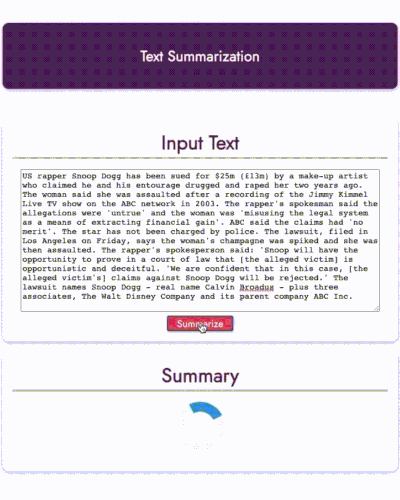

# Text Summarization API Front-end

     

Text summarization tool with [BART (facebook/bart-large-cnn)](https://github.com/pytorch/fairseq/tree/master/examples/bart). It allows you to input your text and see its summary. The BART model is implemented on Flask API and the frontend made with [Vue.js](https://vuejs.org)

You should run also the backend server at the same time with the front. You can take a look on the [API README](./api/README.md).

## Setup

    npm install

### Compiles and hot-reloads for development

    npm run serve

### Compiles and minifies for production

    npm run build

### Lints and fixes files

    npm run lint

### Config

To **deploy** or use it on **local**, please config your path in [config.js](./src/config.js)
